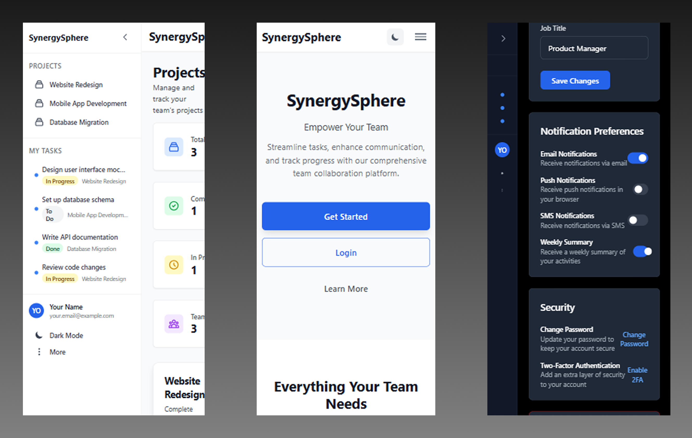
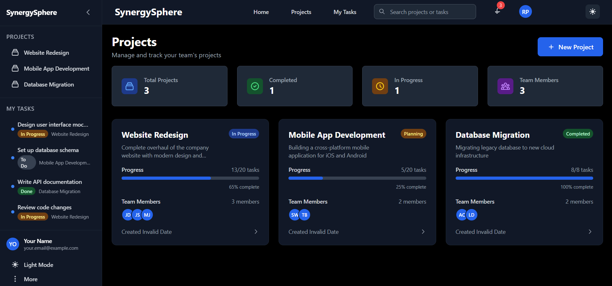
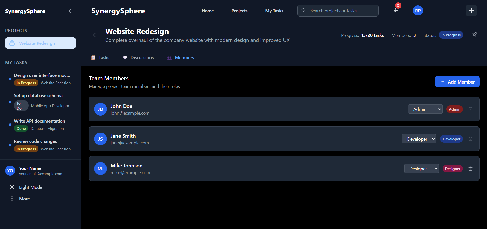

# SynergySphere

[](https://youtu.be/pcbcsmPtEdE?si=Wkj5Mb_srfGDFZXV)


## 🚀 Project Overview

**SynergySphere** is a comprehensive team collaboration and project management platform designed to streamline tasks, enhance communication, and track progress for modern teams. Built with cutting-edge technologies, it provides an intuitive interface for managing projects, tasks, and team interactions.

### ✨ Key Features

- **📋 Task Management**: Organize and track tasks with intuitive kanban boards and project timelines
- **💬 Team Communication**: Stay connected with real-time discussions and threaded conversations  
- **📊 Progress Tracking**: Monitor project progress with visual dashboards and detailed analytics
- **🔍 Proactive Insights**: Get intelligent recommendations and insights to optimize team performance
- **👥 Team Collaboration**: Manage team members, roles, and permissions effectively
- **🌙 Dark/Light Theme**: Switch between themes for comfortable viewing
- **📱 Responsive Design**: Works seamlessly across desktop, tablet, and mobile devices

## 🛠️ Tech Stack

### Backend
- **Node.js** with Express.js framework
- **MongoDB** with Mongoose ODM
- **JWT** for authentication and authorization
- **bcryptjs** for password hashing
- **Nodemailer** for email services
- **Express Validator** for input validation
- **Express Rate Limit** for API protection

### Frontend
- **React 19** with modern hooks
- **React Router DOM** for navigation
- **Tailwind CSS** for styling
- **Vite** for fast development and building
- **Axios** for API communication
- **Lucide React** for icons

## 📁 Project Structure

```
Odoo-Hackathon2025-SynergySphere/
├── Backend/
│   ├── config/
│   │   └── database.js          # MongoDB connection configuration
│   ├── middleware/
│   │   ├── auth.js             # JWT authentication middleware
│   │   └── validation.js       # Input validation middleware
│   ├── models/
│   │   ├── User.js             # User schema and methods
│   │   └── OTP.js              # OTP schema for email verification
│   ├── routes/
│   │   └── auth.js             # Authentication routes
│   ├── utils/
│   │   ├── emailService.js     # Email service configuration
│   │   └── otpGenerator.js     # OTP generation utilities
│   ├── server.js               # Main server file
│   └── package.json            # Backend dependencies
├── Frontend/
│   └── my-app/
│       ├── src/
│       │   ├── components/     # Reusable UI components
│       │   ├── pages/          # Main application pages
│       │   ├── context/        # React context providers
│       │   ├── services/       # API service functions
│       │   └── App.jsx         # Main application component
│       └── package.json        # Frontend dependencies
├── Banner.png                  # Project banner image
├── Mobile.png                  # Mobile app screenshot
├── Project Detailed View.png   # Project detail view screenshot
├── Team Members Section.png    # Team members section screenshot
└── README.md                   # This file
```

## 🔗 API Routes

### Authentication Routes (`/api/auth`)

| Method | Endpoint | Description | Access |
|--------|----------|-------------|---------|
| POST | `/register` | Register a new user | Public |
| POST | `/login` | User login | Public |
| POST | `/verify-email` | Verify email with OTP | Public |
| POST | `/resend-verification` | Resend verification OTP | Public |
| POST | `/forgot-password` | Request password reset | Public |
| POST | `/reset-password` | Reset password with OTP | Public |
| GET | `/me` | Get current user profile | Private |
| GET | `/test-email` | Test email service | Public |

### Health Check
| Method | Endpoint | Description |
|--------|----------|-------------|
| GET | `/api/health` | Server health status |

## 🚀 Getting Started

### Prerequisites

- Node.js (v16 or higher)
- MongoDB (local or cloud)
- npm or yarn package manager

### Installation

1. **Clone the repository**
   ```bash
   git clone https://github.com/yourusername/synergysphere.git
   cd synergysphere
   ```

2. **Backend Setup**
   ```bash
   cd Backend
   npm install
   cp .env.example .env
   # Configure your environment variables in .env
   npm run dev
   ```

3. **Frontend Setup**
   ```bash
   cd Frontend/my-app
   npm install
   npm run dev
   ```

### Environment Variables

Create a `.env` file in the Backend directory:

```env
NODE_ENV=development
PORT=5000
MONGODB_URI=mongodb://localhost:27017/synergysphere
JWT_SECRET=your_jwt_secret_key
JWT_EXPIRE=7d
EMAIL_USER=your_email@gmail.com
EMAIL_PASS=your_app_password
```

## 📱 Screenshots & GIFs


### Mobile Application

*Mobile-responsive design for seamless cross-platform experience*

### Project Detailed View

*Comprehensive project management interface with task tracking and team collaboration*

### Team Members Section

*Team management interface for adding and managing project members*

## 🎯 Features in Detail

### Authentication System
- **Secure Registration**: Email verification with OTP
- **JWT Authentication**: Stateless authentication with refresh tokens
- **Password Security**: bcrypt hashing with salt rounds
- **Account Recovery**: Forgot password with OTP verification

### Project Management
- **Project Creation**: Create and manage multiple projects
- **Task Organization**: Kanban-style task management
- **Progress Tracking**: Visual progress indicators and analytics
- **Team Collaboration**: Add members and assign roles

### User Interface
- **Responsive Design**: Works on all device sizes
- **Dark/Light Theme**: User preference-based theme switching
- **Modern UI**: Clean, intuitive interface with Tailwind CSS
- **Real-time Updates**: Live data synchronization

## 🔧 Development

### Backend Development
```bash
cd Backend
npm run dev    # Start development server with nodemon
npm start      # Start production server
```

### Frontend Development
```bash
cd Frontend/my-app
npm run dev    # Start Vite development server
npm run build  # Build for production
npm run preview # Preview production build
```

## 🧪 Testing

### Backend Testing
```bash
cd Backend
npm test       # Run backend tests
```

### Frontend Testing
```bash
cd Frontend/my-app
npm run lint   # Run ESLint
```

## 📦 Deployment

### Backend Deployment
1. Set up MongoDB Atlas or local MongoDB instance
2. Configure environment variables
3. Deploy to platforms like Heroku, Railway, or DigitalOcean

### Frontend Deployment
1. Build the production version: `npm run build`
2. Deploy to platforms like Vercel, Netlify, or GitHub Pages

## 🤝 Contributing

1. Fork the repository
2. Create a feature branch: `git checkout -b feature/amazing-feature`
3. Commit your changes: `git commit -m 'Add amazing feature'`
4. Push to the branch: `git push origin feature/amazing-feature`
5. Open a Pull Request


## 🙏 Acknowledgments

- Odoo Hackathon 2025 for providing the platform
- React and Node.js communities for excellent documentation
- Tailwind CSS for the beautiful design system
- MongoDB for the robust database solution

## 📞 Support

For support, email synergysphere.syntaxsorcery@gmail.com

---
